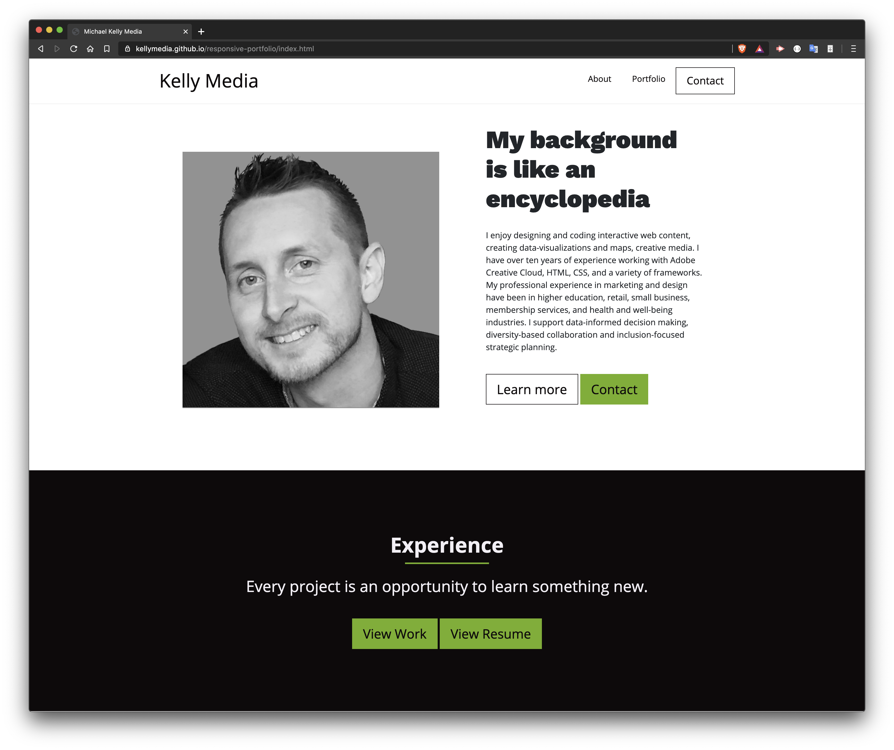

# Responsive Portfolio

  

## Description

This is a mobile responsive portfolio website I built using the Bootstrap4 framework. 

## Demo

Click here for a [demo](https://kellymedia.github.io/bootstrap-portfolio/) of this project.

https://kellymedia.github.io/bootstrap-portfolio/

This image demonstrates the app functionality:

## Feedback

- Ask me a question on [Stack Overflow](https://stackoverflow.com/users/13296428/kellydotmedia)
- Follow [@kellydotmedia](https://twitter.com/kellydotmedia) and me us know what you think!

## License

Licensed under the [MIT](LICENSE.txt) license.
